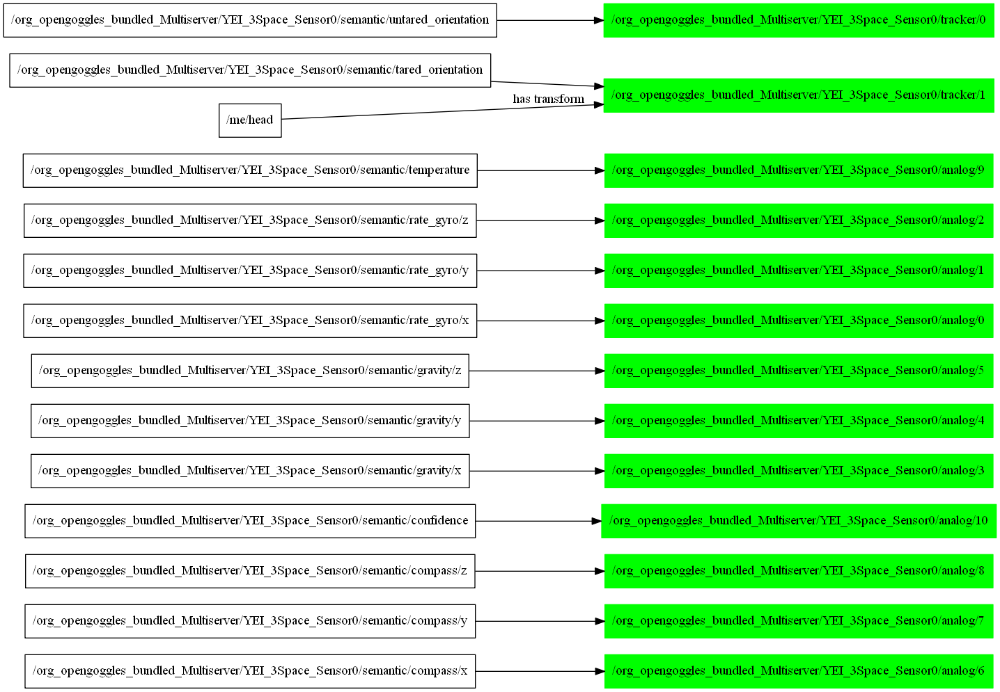

# Path Tree Export

This tool dumps aspects of the path tree to a file or the console in DOT (graphviz) format. You can run with `--help` to get more complete usage information, but here are some common usage suggestions. They all require the graphviz binaries to be installed, with the `dot` tool, at least, in your path.

## Viewing the paths available

The command

```bash
PathTreeExport | dot -Tpdf -o graph.pdf
```

will create a `graph.pdf` file that shows the paths known in a condensed format (each node containing just one path ocmponent). See the example below:


## Viewing the alias configuration

The command

```bash
PathTreeExport -a true -t false -p true | dot -Tpdf -o graph.pdf
```

which is shorthand for

```bash
PathTreeExport --show-aliases true --show-tree false --full-paths true | dot -Tpdf -o graph.pdf
```

will create a `graph.pdf` file that shows just the aliases and the sources of their data, with the full path in each node. See the example below:

