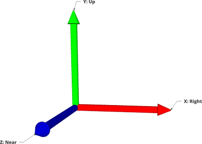

# Writing a client application {#TopicWritingClientApplication}

Writing a client application means you'll be building against the @ref ClientKit library, which presents a C API, as well as some C++ header-only wrappers. The API does not impose a required structure for your application, so you can more easily integrate it with your codebase.

## Important Notes
When running an OSVR application, an OSVR server must be running on the local machine.

While some of the following documentation applies to Unity applications using the OSVR-Unity support, much of it does not. Please see the README file included with the Unity package for Unity-specific documentation.

## Conventions and Units
OSVR standardizes internally on a right-handed coordinate system, with X to the right and Y up (and thus Z "near" or toward you). Choice of coordinate system is planned but not yet available.

Units for position are standardized to be meters.

As is common convention, in any diagrams, the axes X, Y, and Z are represented by red, green, and blue (RGB) arrows respectively.

## Tracking Terminology and Math Types
- **Position** - a 3D vector, with units in meters, specifying displacement from some origin. The simple struct OSVR_Vec3 contains a 3D vector of doubles and is used to represent position. For convenience and clarity, accessor functions are provided.
- **Orientation** - a unit quaternion specifying rotation from the world axes. Here, the simple struct OSVR_Quaternion contains the 4D vector of doubles used for representation. Note that due to differing member orders ($(w, x, y, z)$ vs $(x, y, z, w)$), if you choose to directly use this structure, we recommend using the accessor functions rather than directly accessing array elements.
- **Pose** - A 6 degree-of-freedom rigid body transformation, combining position and orientation. Since there is no scaling or shear, this is an affine transformation (actually an isometry).

While math types are provided, they are **intentionally minimal**: there are countless math libraries already created and there is no need for OSVR to have its own fully-featured one beyond a simple struct containing an array. This is why no operations other than access are provided. It is intended that you develop functions to map the OSVR math types into your existing math library's types.

If you do not have an existing math library, consider using [Eigen](http://eigen.tuxfamily.org/). It is used internally in the OSVR core, and the <osvr/Util/EigenIntegration.h> header provides the mapping methods already. Some reasons why you might want to use Eigen:

- Expressive code syntax (looks just like equations, through C++ operator overloading).
- Very high performance (in some cases faster than Fortran) through expression templates, cache-aware operations, and vectorization.
- Portable and ported (with vectorization optimizations available on at least x86 SSE2 and ARM NEON).
- Fully featured linear algebra library, beyond just the functionality to do 3D computations.
- Widely used and thoroughly tested.
- Liberally licensed.

## Key Concepts
**Interfaces** are the primitive  "pipes of data" in OSVR.
Devices are said to expose interfaces to the OSVR core, and in turn, an application.
Each interface conforms to a generic **interface class**, which in turn defines the set of data provided. A single device may provide data in more than one interface class, e.g., a controller like the Razer Hydra with tracking, buttons, and analog joysticks and triggers.

Common interface classes include the following:

- Tracker (which may track position, orientation, or full pose)
- Button (binary on/off)
- Analog (axis of a joystick, analog trigger value)

OSVR maintains a **"path tree"** -- similar to a URL or filesystem path -- in which all the input and display data is made available. **Aliases** are configured in the server to essentially redirect from a semantic path (a path with a meaningful name) all the way back to the system-specific hardware details. Thus, while direct device access is possible, it is not recommended: instead, we recommend accessing semantic paths. This accommodates use cases where the hardware is not immediately available at startup or is changed during operation without any impact to the application developer.

Some "directories" in the path tree are purely logical associations, while others may provide data on interfaces in addition to possibly containing children. Some paths, instead of providing access to data interfaces, are simply logical addresses for **parameters** - the chief example being the display configuration data.

The base set of semantic paths includes the following:

- `/me` - a pure container for user-related interfaces
- `/me/hands` - Provides access to all hand tracking data.
- `/me/hands/left` - Left hand tracking
- `/me/hands/right` - Right hand tracking
- `/me/head` - Head tracking
- `/display` - a parameter containing a JSON string describing display configuration.

Additionally, these paths are available to access the buttons on the Razer Hydra controllers. Semantic paths will eventually replace them, but this will work for now.

- `/controller/left/1`
- `/controller/left/2`
- `/controller/left/3`
- `/controller/left/4`
- `/controller/left/bumper`
- `/controller/left/joystick/button`
- `/controller/left/middle`
- `/controller/right/1`
- `/controller/right/2`
- `/controller/right/3`
- `/controller/right/4`
- `/controller/right/bumper`
- `/controller/right/joystick/button`
- `/controller/right/middle`

Finally, these are the paths for the analog inputs on the Razer Hydra controllers. Same disclaimer applies.

- `/controller/left/joystick/x`
- `/controller/left/joystick/y`
- `/controller/left/trigger`
- `/controller/right/joystick/x`
- `/controller/right/joystick/y`
- `/controller/right/trigger`

## Call sequence
There are three pieces of a minimal application:

- Initialize the library, providing an application ID, and receiving a "client context" which must be passed to future calls.
- In your application main loop, call the update method, which triggers callbacks and handled state changes.
- During application shutdown, shutdown the library (providing the client context).

@mscfile client-minimal-diagram.msc

Of course, such an application doesn't really use OSVR in a productive sense. A sample flow of a more realistic application would also:

- Probably before the main loop starts:
	- Get some interfaces, 
	- Register callbacks if desired on interfaces.
	- Get display parameter data.
- During main loop:
	- Handle data received by callbacks, if any.
	- Read state of interfaces, if desired.

@mscfile client-common-diagram.msc
