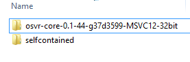
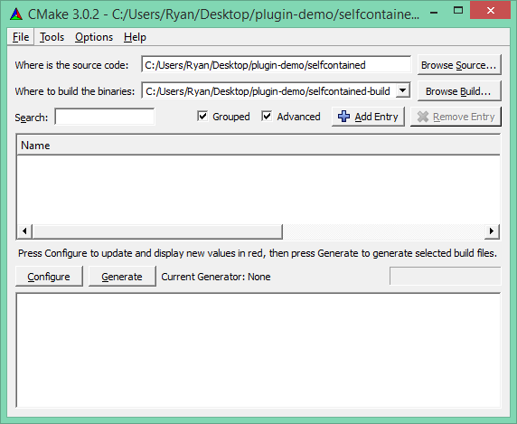
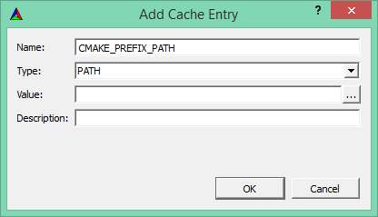
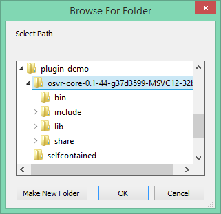
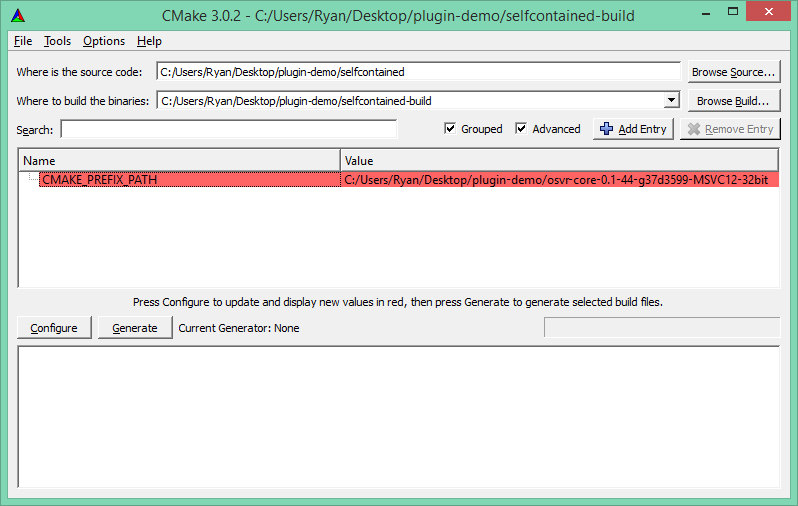
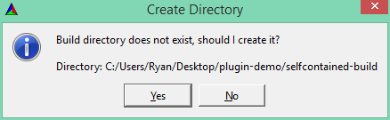
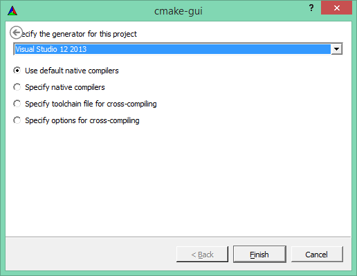
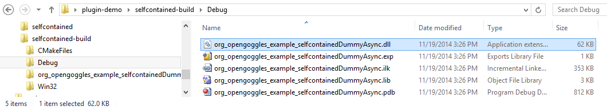

# Writing a basic device plugin              {#TopicWritingDevicePlugin}

Writing a device plugin means you'll be building against the @ref PluginKit library, which presents a C API, as well as some C++ header-only wrappers. The API does not impose a required structure, so you can more easily integrate it with an existing driver codebase. However, the following steps can help you build a plugin from scratch.

1. Make a copy of the directory `/examples/plugin/selfcontained` as the starting point for your new plugin repository.
  - This assumes that your plugin will be "out-of-tree" - that is, not hosted in the main Core repository.
2. Do what it says in that `EXAMPLE_PLUGIN_README.md` file to change the plugin name and build system.
3. Implement a hardware detection callback (to determine if your device is connected):
  - This can take the form of a class with a function call operator (`operator()`), taking `OSVR_PluginRegContext ctx` and returning `OSVR_ReturnCode`.
  - See `/examples/plugin/org_opengoggles_example_DummyHardwareDetectCpp2.cpp` for a sample.
  - See lines 47-51 to see how to create and register an instance of that class.
  - From within your callback, if the device exists, create a device token (see the `DummyAsync` or `DummySync` examples like `org_opengoggles_example_DummyAsync.cpp`).
4. In the hardware poll callback, do lines 63-72 of the DummyAsync file (perhaps skip line 70 if you are using an existing message type).
5. You need to have your device hold on to the device token to send data with it later on.
6. The guts of implementing a device are in line 51 of DummyAsync: wait until there is data then call `osvrDeviceSendData()`. (There are two versions of this function: one where you provide a timestamp, and one where the timestamp is automatically created for you.)
7. To test: there is a bundled application called `BasicServer`.  You can start it and pass names of plugins on the command line. This will load the plugin, do a hardware poll, and enter the run loop.
  - You can use `vrpn_print_messages localhost` to see the messages being sent.

Note that these instructions are only for drivers that can fully self-configure: manually configuring drivers is not available yet.

## Building Your Plugin
These are instructions for Windows and Visual Studio, but they follow similarly for other platforms.

1. *Prep source and deps:* Unzip a build snapshot somewhere convenient, and make sure you have your plugin outside of the directory tree.  

2. *CMake source and binary directories:* Open CMake, and set your source directory (top box) and build directory (second box - make up a different directory that is convenient for you). For easiest results, don't click configure and generate yet - you can still follow these steps if you do, just know you'll get some bogus errors.  

3. *Set `CMAKE_PREFIX_PATH` for deps:* Click the "Add Entry" button. Enter `CMAKE_PREFIX_PATH` as the name and choose `PATH` as the type. Then, click the "..." to open a browse window.       Choose the main directory of the snapshot - this is the one that contains `bin`, `lib`, etc. Then click OK to confirm the directory, and OK again to complete adding the entry.     You'll end up back at the main screen, which now looks like this.  

4. *Configure and generate:* You can now press the "Configure" button. Since your build directory doesn't exist yet, it will ask you for confirmation.     Then, choose your "generator" - the kind of project you want it to generate. You probably want to choose Visual Studio 2013. Once you're back at the main screen, click Generate.  

5. *Open project:* In the build directory you specified, CMake will have generated a `.sln` solution file for you. Double-click to open it, and code/compile your plugin. Note that your snapshot may only have a limited subset of the build configurations included (typically Debug and RelWithDebInfo), so building your plugin in other configurations may not work.

6. *Find your build product:* You'll find your `.dll` file in the equivalent location of the binary tree as it was in the source tree, except inside one further configuration-specific folder (for Visual Studio). You may want to put it in the `bin` directory of a snapshot to more easily use the `BasicServer` to test. 