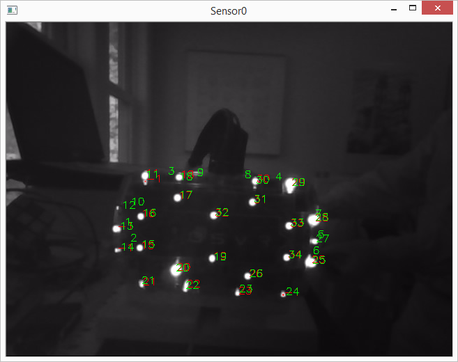

# Developing for the OSVR video-based tracker

This document describes how to develop new devices that will work with the OSVR video-based tracker, including how to design the flash patterns that should be used.  See the [running document](./Running.md) for how to use the camera to track.

## Brief theory of operation

A *beacon* is light source that emits in the near infrared (an LED, for example).  A *sensor* is a device that has four or more beacons rigidly mounted on its surface.

The OSVR video-based tracking system tracks one or more sensors.  The beacons on each sensor flash in synchronization with the video camera, controlled by a digital signal the comes from the camera itself.  On the OSVR HDK, this signal plugs in using a Y adapter to the power cord (as shown below).

The camera takes images at about 100 frames/second.  Each beacon strobes briefly during this time, with the brightness of each consecutive strobe modulated to match a 16-frame pattern.  The exact pattern is detailed below, but each beacon basically has two possible brightnesses for each frame, which we'll call *dim* and *bright*.  Each beacon has a unique 16-frame pattern, which is used to distinguish it from other beacons.  (Note that lights, other LEDs in the environment, and the sun will produce spots on the image but they will not strobe with a specific pattern, so are not recognized as beacons by the tracking system.)

The video-based tracking system is provided with a description for each sensor that includes the strobe patterns of its beacons and also the 3D positions where they are mounted.  It also has a model of the camera's distortion.  It uses the flashing pattern to identify the 2D screen-space positions of each beacon that is visible.  It then finds an error-minimizing pose in 3-space for those beacons to minimize the error of the 3D positions projected through the camera model back onto the screen.  When enough beacons are seen and the error is small enough, it produces a report telling the pose of the sensor with respect to the camera's center of projection and orientation.

## New sensor design

New sensors that are to be compatible with the OSVR video-based tracking system must have beacon flash patterns and layouts that are consistent with the system and which do not include beacons whose flash patterns that match any other beacons in the system, in particular the exiting 40 LEDs on the front and back panels of the OSVR HDK (whose patterns are listed in the appendix).

### Flash patterns

The patterns used are rotationally invariant.  The detection algorithms used in the system act independently on each beacon to determine the pattern.  This enables multiple sensors to operate at an arbitary phase relative to one another while still having their beacons recognized.  **This means that the strobe patterns of all beacons must be unique under all rotations -- shifting an existing pattern one or more frames later does not produce a new pattern.**  Therefore any new patterns introduced must be distinct compared to **all rotations** of existing patterns.

#### Available patterns

The OSVR HDK uses all of the 16-bit, odd-parity patterns with 1 and 3 bright flashes, and four of the patterns with 5 bright flashes.  Patterns with seven or more bright flashes are not currently being used.  Maintaining good error characteristics in the presence of multiple devices will require choosing odd parities for all devices.  There are 2048 total odd-parity codes.

Relaxing the constraint that single-bit errors must result in invalid codes would allow the use of even-parity codes.  None of these codes are currently in use.  There are 2067 total even-parity codes.  Single-bit errors can convert even-parity codes into odd-parity codes.

A program that can determine the set of rotationally-invariant patterns that has the smallest maximum instantaneous power draw can be found [in this repository](https://github.com/sensics/LED_encoding).

#### ToDo: Determine how to allocate codes to vendors

### Beacon layout

The beacons should be arranged in space such that at least four beacons can be seen largely front-on from any angle that the sensor should be tracked.  The image above shows the beacon layout for one view of the OSVR HDK.  There are several criteria for placement, some of which are at odds with one another:

* **Visibility:*  There should be mostly head-on views of at least four beacons from any viewpoint.  Note that there are beacons on the sides, top, and bottom of the HDK that become face-on as the unit is rotated.
* **Separation:** As the sensor moves further from the camera, the beacons come closer together in the image.  As they do so, their bright regions get closer together, which reduces the baseline for measurement (increasing the angular error in the estimates) and eventually causes them to overlap (losing identification of both beacons).
* **Generality:** The pose-estimation algorithms require the poses to be generic.  It does not help to see four beacons if they are in a degenerate configuration where they all lie along the same line because the rotation about that line cannot be determined.
* **Rigidity:** The relative positions of the beacons must remain fixed relative to each other as the sensor is moved.  Flexible objects or beacons mounted on slender portions may move relative to one another, introducing errors in the pose estimation.

### Config files

The OSVR video-based tracker is run using [json](http://www.json.org/)-formatted configuration files that can include descriptions of the sensors it should be looking for, including their flash patterns and 3D positions.  It is also possible to adjust parameters of the algorithm from within the configuration file, enabling peformance tuning without recompilation.  A configuration file that handles just the back-plate sensor on the OSVR HDK is shown below, with a description of its entries following.

    {
        "drivers": [{
            "plugin": "com_osvr_VideoBasedHMDTracker",
            "driver": "VideoBasedHMDTracker",
            "params": {
                "showDebug": true,
                "solveIterations": 5,
                "maxReprojectionAxisError": 4,
                "sensors" : [
                    {
                        "name": "OSVRHDKBack",
                        "requiredInliers": 4,
                        "permittedOutliers": 0,
                        "patterns": [
                                    "*...........**.."
                                  , "......**.*......"
                                  , ".............***"
                                  , "..........*....."
                                  , "...*.......**..."
                                  , "...**.....*....."
                        ],
                        "positions": [
                                [-1, 23.8, -228.6],
                                [-11, 5.8, -228.6],
                                [-9, -23.8, -228.6],
                                [0, -8.8, -228.6],
                                [9, -23.8, -228.6],
                                [12, 5.8, -228.6]
                        ]
                    }
                ]
            }
        }],
        "plugins": [
            "com_osvr_VideoBasedHMDTracker" /* This is a manual-load plugin, so we must explicitly list it */
        ],
        "aliases": {
            "/me/head": "/com_osvr_VideoBasedHMDTracker/TrackedCamera0_0/semantic/hmd/front"
        }
    }

The portion of the config file relevant to the development of new sensors is in the **"params"** section.  The meaning of each parameter is as follows:
* **showDebug**: This parameter controls whether a debuggin window appears showing the video image, identified beacons (in red) and identified sensors (whose beacons become green).  The [running document](./Running.md) describes how to use this window and what is shown in it.
* **solveIterations**: This controls the maximum number of iterations performed by the OpenCV optimization algorithm to determine the optimal pose.  Increasing this can improve tracking accuracy, but it also uses more CPU power and too-large values will eventually reduce tracking rate so much that the system can no longer identify beacons.
* **maxReprojectionError**: This parameter is used to discard bad poses that can cause jitter in the tracking reports.  It is the maximum distance in pixels that either axis (x or y) can vary between the location of a beacon identified in the image and its reprojected 3D location from the model.
* **sensors**: This section provides a list of available sensors in the system.  There can be more than one sensor described, but this example shows only one.  Each sensor is reported with a differnt ID by the video-based tracker.  The first listed sensor is given ID 0.  Within a sensor, there are several fields:

* **name**: Descriptive name of the sensor, currenlty not usd by the system.
* **requiredInliers**: How many beacons must be identified before the system attempts to report a pose.  For the OSVR HDK rear panel, some units only have four of the six sensors visible, so this is chosen as 4.  For the front panel on the HDK, the default configuration requires at least six beacons to be visible to reduce jitter in the reported poses.
* **permittedOutliers**: Reflections of beacons off of specular surfaces, extra lights in the scene, and mis-identified beacons can produce completely wrong estimates for one or a few beacons in the scene.  This parameter specifies how many "outlier" responses are allowed, where the beacon complely mis-matches the expected location.  In this case, the beacon is completely ignored.  In the case of 4 inliers, all are needed.
* **patterns**: There is one pattern for each beacon on the sensor.  These must be listed in the same order as the **positions** parameter described below.  All of the patterns must be of the same length for a given sensor.  If sensors with different pattern lengths are visible together, **all shorter-length subsets of the longer patterns must be distinct from all rotations of all of the shorter patterns present in the scene**.  The rotation of each pattern is not important, because it matches all rotations.  The pattern is encoded using a period ('.') for each dim flash and an asterisk ('*') for each bright flash.
* **positions**: There is one position for each beacon on the sensor.  These must be listed in the same order as the **patterns** parameter described above.  This is the position in millimeters of each object on the sensor.  These can be defined in any consistent coordinate system.  The origin of that coordinate system becomes the origin of the sensor as reported by the video-based tracking system.  The orientation of that coordinate system becomes the orientation reported.

## Appendix: Design criteria and resulting coding for OSVR HDK

The assumptions on the system characteristics, which must be satisfied for the proposed design to work, are given first.  Next come the criteria being optimized, from most important to least.  Different prioritizations for criteria result in different optimal coding algorithms (for example, it is possible to achieve a single bright LED at any given time for a non-error-detecting code using information across LEDs by making a code that is 50 frames long, but this would require almost a second to determine LED identity for a camera operating at 60fps and would require seeing all LEDs).

### Assumptions
* The LED flashing will be synchronized with the camera frames such that they are on high-power or low-power for the duration of exposure for consecutive frames.  This will allow the computer-vision algorithm to reliably detect data values at full frame rate.
* The brightness difference between high power and low power is sufficient to be reliably detected, removing the need for error correcting codes.

### Criteria

* Make a code that is independent, so that each LED can be treated on its own.  **Solution:** Rotationally-invariant code selected.
* Minimize the maximum instantaneous power draw over all LEDs.  **Approach:** A set of encodings with the minimum number of 1’s, subject to being rotationally invariant, was selected.  An iterative optimization algorithm was run to select the best set of rotations, which matched the theoretical minimum number of simultaneous LEDs.
* Minimize time to determine LED identities for 40 LEDs.  **Approach:** A subset of the binary code is selected, where the binary code is the most-efficient encoding of bits.
* Provide an error check so that single-bit errors can be detected.  **Approach:** The set of encodings selected for the HDK has odd parity, so any single-bit error will appear as an invalid code.

### Design

Each LED pattern consists of an infinitely-repeated series of frames.  Each frame consists of a series of bright(1)/dim(0) bits lasting for one camera frame, synchronized with the camera exposures.

There are N bits within a frame (N=16 was selected).  See below for the LED pattern tables.  The patterns have the characteristic that no patterns can be rotated to produce another so that the ID for a particular LED can be reliably determined by looking only at that LED’s sequence.  The relative start time of the transmissions for different LEDs does not matter.  Patterns with even, odd, and no parity checking were tested, to see the impact of enabling parity checking to detect single-bit errors.

This forms a family of encodings parameterized by N (the number of bits used to encode) and parity.  As N increases, the time to determine a complete encoding increases but the maximum number of overlapping LEDs in the high state decreases.  The minimum counts with optimal packing was computed for a range of choices and a size of 16 with odd parity was selected.

#### Encoding

The encoding selected for the OSVR HDK is shown below.  Each period ('.') indicates a dim flash and each asterisk ('*') indicates a bright flash.  The LED index is listed along the left edge (this does not match the final hardware ordering in the as-designed unit).

     0: ***...*........*
     1: ...****..*......
     2: *.*..........***
     3: **...........***
     4: *....*....*.....
     5: ...*....*...*...
     6: ..*.....*...*...
     7: ...*......*...*.
     8: .......*...*...*
     9: ......*...*..*..
    10: .......*....*..*
    11: ..*.....*..*....
    12: ....*......*..*.
    13: ....*..*....*...
    14: ..*...*........*
    15: ........*..*..*.
    16: ..*..*.*........
    17: ....*...*.*.....
    18: ...*.*........*.
    19: ...*.....*.*....
    20: ....*.*......*..
    21: *.......*.*.....
    22: .*........*.*...
    23: .*.........*.*..
    24: ....*.*..*......
    25: .*.*.*..........
    26: .........*.**...
    27: **...........*..
    28: .*...**.........
    29: .........*....**
    30: ..*.....**......
    31: *......**.......
    32: ...*.......**...
    33: ...**.....*.....
    34: .**....*........
    35: ....**...*......
    36: *...........**..
    37: ......**.*......
    38: .............***
    39: ..........*.....

To minimize the maximum instantaneous power, the patterns have been optimally rotated.  A count of the number of LEDs on per time step is: 8 8 8 8 8 7 8 7 8 8 8 8 8 8 8 8.

