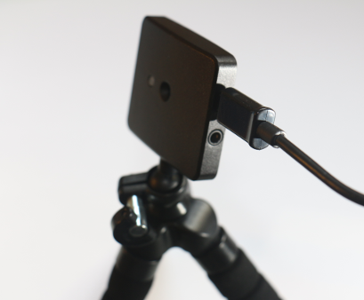
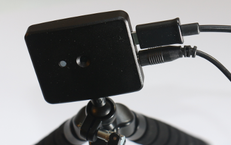
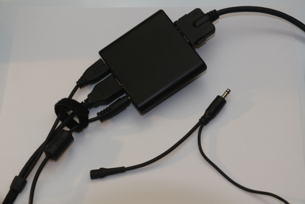

# Using the OSVR HDK's video-based tracker

This document describes how to use the OSVR HDK's video-based tracker, including how to plug in the camera and run a server that will use it.  See the [development document](./Developing.md) for how to develop new peripherals that would make use of the HDK camera to track objects in the scene.

## Set-up

The video-based tracking module uses a custom infrared camera that plugs into the server computer via USB  and into the HDK belt-pack via a phono connector.  It is run using using the standard OSVR server with a different configuration file that causes it to load a plug-in to do video-based tracking using the camera.

### Plugging in the unit

The camera ships with a small three-legged tripod that can be used to position and aim it at the field of view you want to track.  The tripod screws into the bottom of the camera and has a freely-rotating ball joint that can be tightened to point the camera.

First plug the USB cable, shipped with the HDK, into the micro-USB port on the side of the camera.

Next, plug the phono cable that is attached to the power-supply connector into the camera.  Note: Be sure to plug the connector **all the way in** so that the edge of the connector is right up against the side of the camera.  The connector will go in easily most of the way and then snaps in after a final push.

Finally, plug the synchronizing power adapter.  This is shown disconnected in the image below.  The power adapter plugs into the left end of the cable and the right end of the cable plugs into the belt pack.  This inserts both power and the camera synchronization signal into the belt back, and from there into the HDK.

### Running the server

## Debugging

## Coming Soon

Sensics is developing an analysis plug-in that will combine video + intertial tracker reports into a single tracker state that includes estimates on velocity and acceleration.

